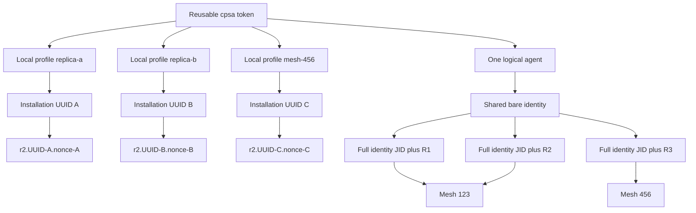
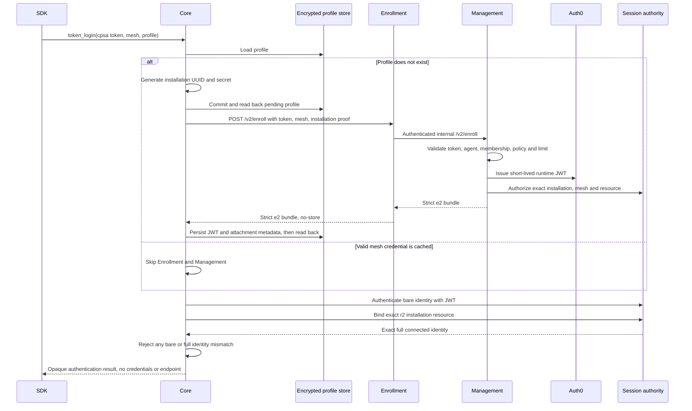
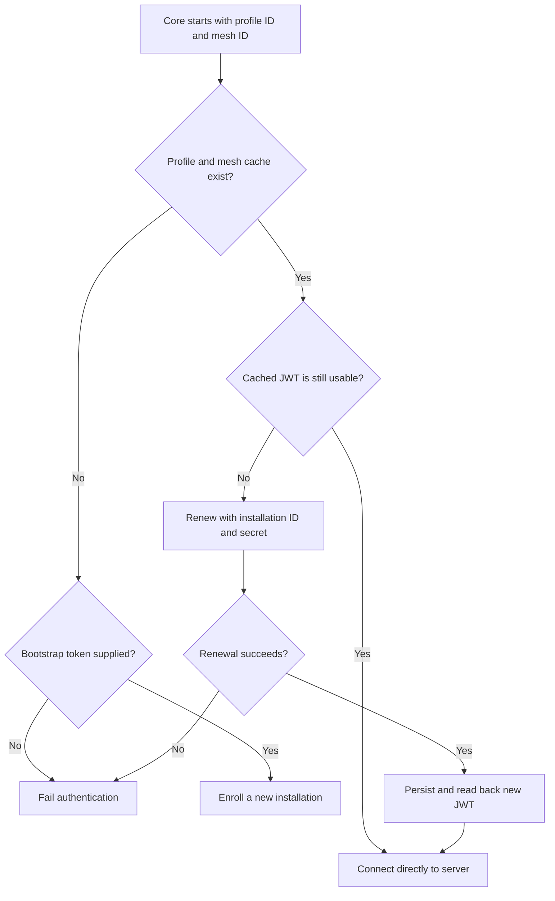

# Enrollment and runtime authentication v2

This is an internal developer document. It names the private transport identity
and credential fields that Core intentionally hides from SDK users. Public SDK
contracts must continue to treat agent identifiers, mesh identifiers, and
authentication as opaque concepts.

## What changed

Authentication v2 changes token login from a token-and-mesh cache into an
installation-centric identity model:

- one reusable `cpsa_` enrollment token identifies one logical agent;
- a caller-selected local profile creates or reopens one installation;
- installations created with the same token share the logical agent identity;
- every installation receives a distinct server-authorized session resource;
- the same token can create multiple installations in one mesh or installations
  in different meshes, subject to Management policy and membership;
- the bootstrap token is discarded after enrollment and is not required for a
  normal restart;
- one encrypted profile holds the installation secret and its mesh-scoped JWT
  cache;
- Core renews credentials in the background and supplies a fresh cached JWT to
  reconnect attempts;
- the administrator controls the offline cold-start target and whether an
  established session continues or disconnects when its JWT reaches expiry;
- the old username/password commands and the v1 enrollment-state migration path
  remain available.

The public commands are:

| Command | Required input | Purpose |
| --- | --- | --- |
| `auth.token_login` | token, mesh ID, optional profile ID | Enroll or reopen an installation with HTTP Bridge behavior |
| `auth.token_connect` | token, mesh ID, optional profile ID | Enroll or reopen an installation with native behavior |
| `auth.installation_login` | profile ID, mesh ID | Reopen without the bootstrap token, using HTTP Bridge behavior |
| `auth.installation_connect` | profile ID, mesh ID | Reopen without the bootstrap token, using native behavior |

An omitted profile ID on a token command selects `default`. Installation
commands require an explicit profile ID.

## Identity model

The model has several identifiers because each has a separate lifecycle and
authorization purpose.

| Value | Example | Meaning and ownership |
| --- | --- | --- |
| Enrollment token | `cpsa_e1.<grant-uuid>.<secret>` | Reusable bootstrap credential for one logical agent. Management issues, limits, rotates, and revokes it. |
| Agent UUID | `5e98...` | Stable Management database identity for the logical agent. It is not a connection address. |
| Display name | `build-runner@acme.agents...` | Human-facing metadata. It never selects or proves the authenticated identity. |
| Bare identity | `agent-account@example.net` | Shared authenticated account returned as both `agent_jid` and `username` in an e2 bundle. All installations made from the token use this account. |
| Profile ID | `replica-a` | Caller-selected local storage namespace. It is never sent as an authorization identity. |
| Installation ID | UUIDv4 | Stable identity of one installed Core profile. Core generates it before enrollment and keeps it across restarts. |
| Mesh ID | Opaque mesh identifier | Authorization scope selected for an enrollment or login. It is not encoded into the authenticated account or session resource. |
| Session resource | `r2.<installation-uuid>.<nonce>` | Server-issued exact resource authorized for the installation and mesh attachment. |
| Full connected identity | `<bare-identity>/<session-resource>` | One live address. Server and Core both require the exact value during resource binding. |

The current resource grammar is:

```text
r2.<canonical installation UUID>.<canonical base64url nonce>
```

Management creates the nonce from 12 random bytes and persists the complete
resource with the installation. An idempotent retry for the same installation
and installation secret returns the same resource. A new installation receives
a new installation UUID and nonce. The nonce is therefore an installation
resource nonce, not a new value for every TCP connection or process restart.

For example, three running installations created with the same enrollment token
can authenticate as:

```text
agent-account@example.net/r2.11111111-1111-4111-8111-111111111111.k3cM_9r0gY2uWQpA
agent-account@example.net/r2.22222222-2222-4222-8222-222222222222.Qk8pXv7aJs1mNd4R
agent-account@example.net/r2.33333333-3333-4333-8333-333333333333.5Fj2bPqL0yHn6wCs
```

All three have the same bare identity. The full identities are distinct, so
ejabberd can keep all three sessions online at the same time. The first two may
be replicas in the same mesh while the third belongs to another authorized
mesh. Mesh authorization remains separate from resource identity.



`profile_id` and `installation_id` are related but are not interchangeable.
The profile ID helps an application find local state. The installation UUID is
the durable identity recognized by Enrollment, Management, and ejabberd. Copying
a profile directory would copy the same installation identity and resource, so
replicas must use separate profile IDs or separate state roots and enroll
independently.

## Initial enrollment

The SDK accepts exactly this bootstrap-token grammar:

```text
cpsa_e1.<canonical-lowercase-uuid>.<43-character-base64url-secret>
```

Core does not ignore arbitrary text before an underscore. The public boundary
validates the exact `cpsa_` prefix and grammar, then retains only the 83-byte
`e1.<uuid>.<secret>` body internally. The private v2 HTTP client restores the
exact public prefix when it calls `/v2/enroll`.

Before its first request, Core generates one UUIDv4 installation ID and one
32-byte installation secret and durably commits both. Bounded retries reuse that
pair, which makes a lost response safe to retry without accidentally consuming
another installation slot.



The e2 response is a strict object. Core rejects unknown fields, duplicate
fields, inconsistent identities, malformed endpoints, unsupported policies,
invalid revisions, oversized credentials, or a resource that does not meet the
closed format constraints. Its private fields include:

```text
version, organization_id, agent_id, agent_jid, installation_id, mesh_id,
session_resource, mesh_endpoint, username, server, access_token, expires_in,
wrapper, display, installation_epoch, attachment_revision, token_id,
policy_revision, session_expiry_mode, offline_cold_start_target_seconds
```

`agent_jid` must equal `username`. `display` is cleared and is never used for
authentication, routing, resource binding, or authorization. Core also clears
the legacy wrapper before persistence.

## Profile and credential storage

The v2 persisted structure is installation-centric:

```text
Profile
  version: 2
  profile_id: caller-selected local namespace
  installation_id: stable UUIDv4
  installation_secret: renewal proof
  agent_id: stable logical agent UUID
  credentials:
    <mesh-id>:
      bundle: private e2 connection and policy fields
      received_at: UTC timestamp
      usable_until: UTC timestamp
```

The map permits Core to keep mesh-scoped credentials without duplicating the
installation secret. A profile accepts at most 256 mesh entries and rejects a
credential whose installation or agent identity differs from the profile.

Production state defaults to the operating-system user configuration directory
under `Cynapsa/Core/auth-v1`. Container deployments must point
`CYNAPSA_STATE_DIRECTORY` at a persistent directory or volume owned by that
installation. The directory must be mode 0700 and files mode 0600. Core rejects
symlinks, unsafe permissions, malformed state, duplicate JSON fields, and
authentication failures.

Each profile is sealed with AES-256-GCM under a random local master key. Writes
use a cross-process writer lock, atomic replacement, directory synchronization,
and mandatory readback before bootstrap material is discarded. The enrollment
token is neither stored nor used to derive the encryption key. Legacy v1 state
for the default profile is migrated in place and removed only after verified v2
storage.

The master key is currently a mode-0600 file in the same state directory as the
ciphertext. This protects a profile file copied by itself and removes dependence
on the reusable enrollment token. It does not protect against theft of the
complete state directory. A platform keystore or hardware-backed key is the
planned stronger boundary.

## Restart and intermittent execution

After successful enrollment, applications should restart with
`auth.installation_login` or `auth.installation_connect`. The bootstrap token is
not needed and should not be retained by the application.



A Core that runs only occasionally does not have to wake at a fixed renewal
time. On every start it evaluates the cached credential:

- while the JWT is usable, it connects directly without calling Enrollment;
- when the JWT is expired, it renews before attempting server login;
- without a cached credential, a token command enrolls while an installation
  command attempts renewal with the stored installation proof;
- if renewal is required while Enrollment is unavailable, the new session
  fails closed.

Core computes `usable_until` as the earlier of the JWT `exp` claim and receipt
time plus `expires_in`, then reserves a five-minute safety margin for the
reported offline-start deadline. Parsing `exp` establishes a local deadline but
does not claim signature verification. The server remains responsible for JWT
signature, issuer, audience, algorithm, and claim verification.

## Background renewal and reconnect

After a successful token or installation login, Core starts one renewal worker
for that profile and mesh. The administrator-provided offline cold-start target
is between zero and 86,400 seconds. Core schedules preparation early enough to
retain that reserve plus the safety margin. A zero target disables the reserve
and uses the short renewal lead instead.

Renewal uses only the installation UUID, installation secret, and mesh ID. It
does not send or require the `cpsa_` token. Transient failures use jittered,
bounded backoff. Rejection or an invalid response marks the in-memory credential
source denied. A successful renewal is atomically persisted and becomes the
credential source for future clean connections and reconnects, so a reconnect
does not reuse the JWT copied at initial login.

The public authentication result exposes readiness without revealing private
connection data:

```text
profile_id, credential_expires_at, offline_start_deadline,
offline_cold_start_target_seconds, offline_target_satisfied,
policy_revision, session_expiry_mode, preparation_status
```

## Expiry policy

The server policy is included in the e2 bundle and applied by both Core and the
session authority.

| Mode | Established connection at JWT expiry | New connection, reconnect, or resume |
| --- | --- | --- |
| `continue` | May remain established across a temporary control-service outage while its authenticated data link remains healthy | Requires a currently valid credential |
| `disconnect` | Closes at the authenticated deadline | Requires a currently valid credential |

The default is `continue`. It supports agents that run intermittently and avoids
turning a temporary Enrollment outage into an immediate outage for an already
authenticated session. It does not make the expired JWT reusable. Any clean
login, reconnect, or stream resume after expiry obtains a current credential or
fails closed.

The `continue` mode separates an established data capability from control
readiness. A temporary authority-server outage blocks discovery, new links,
restarts, and Rank 2 traffic, while an already authenticated Rank 1 link may
continue. Fresh authenticated reconciliation fences the old snapshot before
reopening setup. This availability choice means a server-side revocation made
during the partition cannot be observed until control connectivity returns.

## Revocation boundaries

Revocation is server-authoritative. Core does not infer authorization merely
because a JWT remains in its encrypted cache.

| Administrative action | Effect |
| --- | --- |
| Revoke the reusable enrollment token | Blocks new installations made with that token. Existing installations and their installation secrets remain independently manageable. |
| Revoke one installation | The session authority rejects or terminates that installation resource and renewal is denied. Other installations made from the same token remain valid. |
| Remove one mesh membership | Invalidates that mesh attachment and its exact sessions. Other mesh attachments remain valid. |
| Disable the logical agent | Denies enrollment and renewal for every installation; server enforcement controls active sessions. |
| Raise an installation epoch or attachment revision | Fences credentials and attachment registrations carrying older values. |

A revoked installation may still have ciphertext on disk. Possession of that
cache is insufficient because ejabberd checks the current server-side
installation and attachment authority. Core will stop using a credential source
after a definitive renewal rejection, but local file deletion is not the source
of revocation truth.

## Replica and multi-mesh deployment patterns

Use a separate profile for every independently running installation:

```text
token_login(token, mesh-123, profile=replica-a)
token_login(token, mesh-123, profile=replica-b)
token_login(token, mesh-456, profile=mesh-456-a)
```

This produces one shared logical agent and bare identity, plus three installation
UUIDs and three exact resources. The two mesh-123 processes may be online
simultaneously as replicas. The mesh-456 process uses the same enrollment token
but receives only the authorization for mesh-456.

Core storage can represent multiple mesh credential entries in one profile.
The current Management installation record binds an installation UUID to the
mesh selected when that installation is created. Therefore an end-to-end
deployment should currently use a distinct profile and installation for each
mesh, as shown above. Reusing one profile ID against another mesh is reserved
for a future multi-attachment server model and can be rejected as an
installation identity conflict today.

One Core instance selects one authenticated runtime graph at a time. Concurrent
replicas are separate Core processes or SDK instances with independently
persisted profiles. Do not mount one writable state directory into concurrent
replicas and do not copy an enrolled profile as a scaling mechanism.

The distinct full identities make simultaneous delivery possible, but delivery
semantics are a separate layer:

- one-way events reserve the eligible local batch atomically and attempt every
  current healthy same-mesh installation resource; complete success is reported
  only when all selected instances accept local responsibility;
- a partial fanout returns an uncertain aggregate failure after attempting the
  remaining healthy instances. The failed endpoint stays fenced, so
  callers must not blindly replay a semantic action without application-level
  idempotency;
- work requests select one current endpoint deterministically. Automatic replay
  after ambiguous delivery still requires a competing-consumer lease and
  completion boundary;
- replies and session control target an exact full connected identity.

The resource format enables these policies. It does not by itself implement
load balancing, replay, or exactly-once processing.

## Private data and public boundary

The enrollment token, installation secret, access token, legacy wrapper,
display metadata, server resource, and mesh endpoint stay behind the SDK
boundary. Public status and completion values do not expose the connection
endpoint or credentials. Public `AgentID` is an opaque identifier to SDK code,
even though the current private implementation validates it against the
authenticated bare account.

Internal clearable byte slices own credential material through provider
handoffs and are cleared when the operation ends. Strings created by JSON,
HTTP, or authentication libraries cannot be guaranteed to be zeroized. Logs,
errors, test evidence, and diagnostics must not contain secret-bearing request
or response values.

## Compatibility and current limitations

- Username/password `auth.login` and `auth.connect` remain available during the
  migration period.
- The v1 token-state path remains only for safe migration into the default v2
  profile. New v2 work uses `/v2/enroll` and `/v2/renew`.
- The current runtime issuer is hidden behind the Enrollment and Management
  boundary. Core treats the JWT as an opaque credential and does not depend on
  how it is issued.
- Offline cold start works only until the cached JWT's usable deadline. An
  expired cold start requires reachable Enrollment and Management services.
- The full-state-directory theft limitation remains until profile encryption
  moves to a platform or hardware-backed key store.
- One installation per mesh is the currently qualified Management model. A
  single installation with several simultaneous mesh attachments is not yet an
  end-to-end supported deployment.
- One-way replica fanout is implemented and qualified separately. Automatic
  exactly-once competing-consumer failover for requests still requires a
  distributed claim and idempotency protocol.

## Verification

Focused Core tests cover exact token parsing, strict e2 response validation,
same-token replica profiles, different-mesh profiles, token-free restart,
legacy migration, background renewal, credential expiry, fresh reconnect
credentials, and exact resource binding. Repository-wide validation remains:

```bash
go test ./...
go vet ./...
go build -buildmode=c-shared ./cmd/cynapsacore-shared
```

Cross-repository live authentication and revocation evidence is maintained in
the `CynapsaTests` repository. It is the acceptance source for Management,
Enrollment, Auth0, ejabberd, and Core working together.
